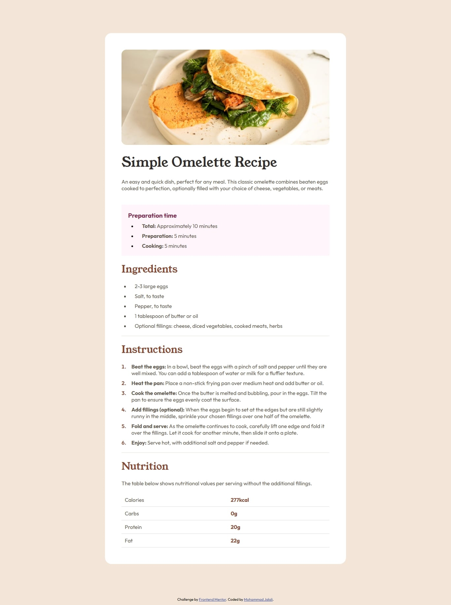

# Frontend Mentor - Recipe page solution

This is a solution to the [Recipe page challenge on Frontend Mentor](https://www.frontendmentor.io/challenges/recipe-page-KiTsR8QQKm). Frontend Mentor challenges help you improve your coding skills by building realistic projects. 

## Table of contents

- [Overview](#overview)
  - [The challenge](#the-challenge)
  - [Screenshot](#screenshot)
  - [Links](#links)
- [My process](#my-process)
  - [Built with](#built-with)
  - [What I learned](#what-i-learned)
- [Author](#author)

## Overview
This project focuses on modern and clean web development practices. Key features include:  

- **Semantic HTML:** Used meaningful tags to improve structure and accessibility.  
- **BEM Methodology:** Implemented a consistent and maintainable class naming system.  
- **CSS Custom Properties:** Leveraged CSS variables for flexible and reusable styling.  
- **Full Responsiveness:** Ensured compatibility across various devices and screen sizes.  

### Screenshot

### Links

- Solution URL: [Add solution URL here](https://your-solution-url.com)
- Live Site URL: [Add live site URL here](https://your-live-site-url.com)

## My process

### Built with

- Semantic HTML5 markup
- CSS custom properties
- Flexbox
- Responsive Design

### What I learned

In this project, I aimed to implement modern development practices by using semantic HTML tags, employing the BEM methodology for class naming, utilizing CSS custom properties, and ensuring the design is fully responsive across various screen sizes.

## Author

- Telegram - [@mohammad11jj](https://t.me/mohammad11jj)
- Frontend Mentor - [@mohammad11jj](https://www.frontendmentor.io/profile/mohammad11jj)
- LinkedIn - [@jalalimohammad](https://www.linkedin.com/in/jalalimohammad/)

